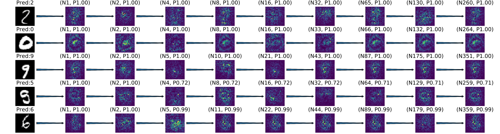
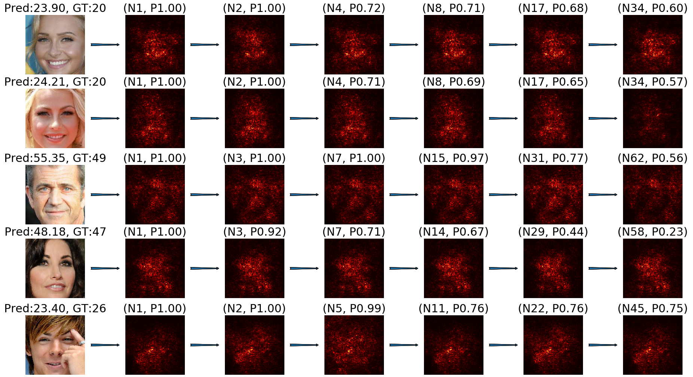

# VisualizingNDF
The repository contains pre-trained model and code for visualizing deep neural decisoin forest. For now the classification models are released and you can contact me if you are interested in the regression models for face alignment. In addition, visualizing for a model trained for facial age estiamtion will be released soon, which achieved state-of-the-art accuracy and comsumes less memory. Finally, this repository is version 1.0 with more comments to write.

## Results for Image Classification
<div align="center">
    
</div>
<div align="center">
    
</div>

## Results for Facial Age Estimation
Note how the irrelevant texture (e.g. hair) is ignored by the model during the decision making process.
<div align="center">
    
</div>
## Accuracy on CACD
| Model             | Error        | Memory Usage | FLOPs
| ----------------- | ----------- | ----------- | ----------- |
| [DRFs_CVPR 18'](https://github.com/shenwei1231/caffe-DeepRegressionForests)    | 4.637      | 539.4MB | 16G
| [RNDF (Ours)](https://arxiv.org/abs/1908.10737)             | 4.595      | 112.4MB | 4G

## Requirements
* Python 3.6 (not tested for other versions)
* PyTorch 1.0 

## Pre-trained models
You can download the pre-trained models at https://drive.google.com/drive/folders/1DM6wVSknkYBqGf1UwHQgJNUp40sYDMrv?usp=sharing and place them in the "pre-trained" folder.

## Visualization
After downloading the pre-trained models, go to /src and
simply run 
```bash
python ndf_vis.py 
```
for CIFAR-10.

For MNIST, run 
```bash
python ndf_vis.py -dataset 'mnist'
```
The code for visualizing NDF for facial age estimation is under final cleaning.

## Train
To train a deep neural decision forest for CIFAR-10, use 
```bash
python main.py
```
For MNIST, run 
```bash
python main.py -dataset 'mnist' -epochs 50
```
## License
MIT

## Citation
Please consider citing the related papers in your publications if they help your research:

    @InProceedings{Li_2019_CVPR_Workshops,
    author = {Li, Shichao and Cheng, Kwang-Ting},
    title = {Visualizing the Decision-making Process in Deep Neural Decision Forest},
    booktitle = {The IEEE Conference on Computer Vision and Pattern Recognition (CVPR) Workshops},
    month = {June},
    year = {2019}
    }
    
    @article{li2019facial,
      title={Facial age estimation by deep residual decision making},
      author={Li, Shichao and Cheng, Kwang-Ting},
      journal={arXiv preprint arXiv:1908.10737},
      year={2019}
    }

Links to the papers:

- [Visualizing the decision-making process in deep neural decision forest](http://openaccess.thecvf.com/content_CVPRW_2019/papers/Explainable%20AI/Li_Visualizing_the_Decision-making_Process_in_Deep_Neural_Decision_Forest_CVPRW_2019_paper.pdf)
- [Facial age estimation by deep residual decision making](https://arxiv.org/abs/1908.10737)
